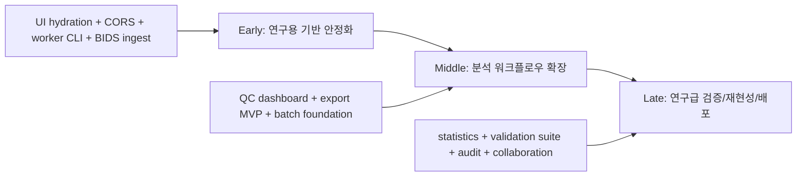

# NeuroWeave Research Tool Completion Roadmap

작성일: 2026-05-25

업데이트: 2026-05-25, 코드 검증 및 5월 25-26일 안정화 파이프라인 반영

## 현재 판단

지금까지 만든 것은 "실제 데이터로 끝까지 도는 분석 MVP"이다. 현재 상태는 실제 공개 EEG 데이터 2종에서 ingestion -> preprocessing -> epoch -> ERP -> comparison까지 끝까지 도는 검증 가능한 프로토타입이다. 다만 연구 결론을 바로 산출하는 도구라기보다는, 연구용으로 신뢰할 수 있는 툴이 되기 위한 안정화, 재현성, 검증 단계가 남아 있다.

기준은 BIDS EEG 구조와 MNE/MNE-BIDS 관례를 따라가는 것이 맞다. 6월 10일까지의 현실적인 목표는 "논문 결과 산출용 완성판"이 아니라, 실제 공개 EEG 데이터를 반복해서 넣고 검토할 수 있는 research exploration alpha이다.

## 현재 코드 검증 결과

검증 기준 시점: 2026-05-25

- Git 상태: clean
- Python 테스트: `apps/api/.venv/Scripts/python.exe -m pytest tests --basetemp=data/cache/pytest-tmp -o cache_dir=data/cache/pytest-cache`
  - 결과: 96 passed
  - 주의: 기본 pytest 실행은 `C:\Users\USER\AppData\Local\Temp\pytest-of-USER` 권한 문제로 실패할 수 있으므로 repo 내부 `--basetemp`를 사용한다.
- Web build: `C:\Program Files\nodejs\npm.cmd run build`
  - 결과: TypeScript check 및 Vite build 통과
  - 주의: PowerShell에서 `npm`은 execution policy 때문에 `npm.ps1`이 막힐 수 있으므로 `npm.cmd`를 직접 호출한다.

## 현재 코드에서 바로 보이는 수정 필요점

- `apps/web/src/main.tsx`: event log가 mapping 직후에는 state에 들어가지만, 새로고침/재접속 시 `/datasets/{id}/events`를 다시 fetch하지 않아 UI가 `Unmapped`로 보인다.
- `apps/api/main.py`: CORS allowlist가 `5173/5174`에 고정되어 있어 임시 dev port에서 UI가 API unavailable로 보일 수 있다.
- `apps/api/main.py` worker subprocess: 현재 API thread queue + `multiprocessing.spawn` + result queue 구조이다. 연구용이면 CLI entrypoint 기반 worker로 분리해 Windows spawn/pickle/result_queue 의존을 제거하는 것이 맞다.
- `packages/eeg-io`: BIDS sidecar를 읽지 않아 OpenNeuro `.set`에서 channel type warning이 발생한다.
- `packages/eeg-io/src/eeg_io/event_logs.py`: BIDS `events.tsv`의 `n/a`, row filtering, condition source preset이 부족하다.
- warnings는 아직 string 중심이다. 연구용이면 severity/code/impact/action이 있는 structured warning이 필요하다.

## 전체 파이프라인



## 6월 10일까지의 현실 목표

6월 10일까지 완료 가능한 범위는 초반 안정화 전체와 중반 일부이다.

완료 목표:

- UI hydration + CORS env화
- preprocessing/epoch/ERP worker CLI 분리
- BIDS sidecar ingest MVP
- BIDS event mapping/filter preset MVP
- structured warning/diagnostics MVP
- QC dashboard 1차
- export bundle MVP
- 공개 EEG 데이터 최소 2종에서 ingest -> preprocessing -> epoch -> ERP -> comparison 통합 smoke

6월 10일 이후로 미루는 범위:

- full statistics phase
- permutation test 및 multiple comparison correction
- full reproducibility graph
- collaboration/share snapshot
- 대규모 visual regression suite
- multi-subject batch의 완성형 UI

## 5월 25일 상세 파이프라인: UI Hydration + CORS 안정화

목표: 새로고침/재접속 후에도 dataset context가 실제 backend 상태와 일치하도록 만들고, dev port 변화에 견디는 API 연결 구조를 만든다.

### 1. Baseline 고정

실행:

- `apps/api/.venv/Scripts/python.exe -m pytest tests --basetemp=data/cache/pytest-tmp -o cache_dir=data/cache/pytest-cache`
- `C:\Program Files\nodejs\npm.cmd run build`

완료 기준:

- Python 테스트 96개 통과
- Web build 통과
- Windows temp 권한 문제는 문서화하고 repo 내부 basetemp를 표준 테스트 명령으로 사용

### 2. CORS env화

추가할 env:

- `NEUROWEAVE_CORS_ORIGINS`
- 예: `http://localhost:5173,http://127.0.0.1:5173,http://localhost:5174,http://127.0.0.1:5174`

기본값:

- 기존 `5173/5174` allowlist 유지

개발 확장 옵션:

- `NEUROWEAVE_CORS_ALLOW_LOCALHOST_PORTS=true`
- true일 때만 `localhost`/`127.0.0.1` 임의 port 허용 regex 사용

안정성 기준:

- production-like 실행에서는 명시 allowlist가 우선
- launcher, README, `.env.example` 흐름을 깨지 않음
- CORS 설정이 실패해도 기본 개발 포트는 계속 동작

### 3. `loadDatasetContext(datasetId)` 도입

우선 `apps/web/src/main.tsx` 내부 helper로 시작하고, 커지면 `apiClient.ts` 또는 dataset context hook으로 분리한다.

한 번에 로드할 API:

- `GET /datasets/{datasetId}`
- `GET /datasets/{datasetId}/events`
- `GET /datasets/{datasetId}/validation`
- `GET /datasets/{datasetId}/preprocessing-runs`
- `GET /datasets/{datasetId}/epoch-runs`
- `GET /datasets/{datasetId}/erp-runs`

404 처리:

- `/events` 404는 정상 unmapped 상태로 보고 `eventLog=null`
- `/validation` 404는 에러가 아니라 `validation=null`
- dataset detail 404만 active dataset invalid 처리

호환성 기준:

- 기존 `refreshPreprocessingRuns`, `refreshEpochRuns`, `refreshErpRuns`는 유지
- polling silent refresh는 기존 run refresh 함수 계속 사용
- API response shape 변경 없음

### 4. Active dataset 변경 흐름 재정리

현재 흐름:

- dataset 변경 -> preprocessing/epoch/ERP runs만 refresh

변경 후:

- dataset 변경 -> `loadDatasetContext(datasetId)` 실행
- eventLog, validation, preprocessingRuns, epochRuns, erpRuns를 같은 dataset 기준으로 갱신

race 방지:

- `isCurrent` flag 또는 `AbortController` 사용
- 빠르게 dataset을 바꿔도 이전 응답이 새 dataset state를 덮지 않게 함

완료 기준:

- mapped event log가 있는 dataset을 새로고침해도 Events가 `Unmapped`로 돌아가지 않음
- valid dataset 새로고침 후 preprocessing 버튼 상태가 실제 validation/dataset status와 일치
- dev server가 5175 같은 임시 port로 떠도 설정 기반으로 API 연결 가능
- 기존 Python 테스트와 web build 통과

## 5월 26일 상세 파이프라인: preprocessing worker CLI 분리

목표: preprocessing 실행 경계를 API process 밖으로 분리해 Windows spawn/pickle/result_queue 의존을 제거하고, epoch/ERP로 확장 가능한 worker 계약을 만든다.

### 1. CLI 계약 먼저 고정

새 모듈:

- `packages/eeg-processing/src/eeg_processing/worker_cli.py`

실행 형태:

- `python -m eeg_processing.worker_cli preprocessing --payload payload.json --result result.json`

payload v1:

```json
{
  "schema_version": 1,
  "job": "preprocessing",
  "run_id": "preprocess-...",
  "input_path": "...",
  "output_path": "...",
  "config": {
    "high_pass_hz": null,
    "low_pass_hz": 40,
    "notch_hz": 50,
    "resample_hz": null,
    "reference": "average"
  }
}
```

result v1:

```json
{
  "schema_version": 1,
  "status": "completed",
  "metadata": {},
  "warnings": [],
  "error": null
}
```

### 2. API wrapper는 기존 함수명 유지

유지할 함수:

- `_run_preprocessing_subprocess(run_id, input_path, output_path, config)`

내부 변경:

- multiprocessing `Queue` 대신 payload JSON 작성
- `sys.executable -m eeg_processing.worker_cli ...` 실행
- result JSON 읽기

호환성 기준:

- 기존 API response shape 유지
- 기존 tests의 monkeypatch 지점 유지
- epoch/ERP 전환 때 같은 패턴 재사용 가능

### 3. run directory에 worker artifact 저장

저장 위치:

- `data/runs/{run_id}/worker_payload.json`
- `data/runs/{run_id}/worker_result.json`
- `data/runs/{run_id}/worker_stdout.log`
- `data/runs/{run_id}/worker_stderr.log`

`output_metadata` optional key:

- `worker_schema_version`
- `worker_payload_path`
- `worker_result_path`
- `worker_exit_code`

호환성 기준:

- 기존 `warnings`, `errors`, `output_path`, `output_metadata` 유지
- 새 metadata는 optional field로만 추가
- 구버전 run JSON도 계속 로드 가능

### 4. Cancellation 유지

API가 subprocess process id를 소유한다.

`CANCELLING` 감지 시:

- graceful terminate
- timeout 후 kill
- 기존 warning 문구 유지: `Cancellation terminated preprocessing subprocess.`

완료 직후 cancel race도 기존 로직 유지:

- output retained
- status는 cancelled 처리 가능

### 5. 테스트 범위

기존 preprocessing API tests는 유지한다.

추가할 테스트:

- CLI payload -> completed result JSON 생성
- CLI failure -> failed result JSON 생성
- result JSON이 없고 exit code만 있을 때 failed 처리
- cancellation 시 process terminate 경로 유지

완료 기준:

- preprocessing run이 API 내부 multiprocessing target 직접 호출 없이 실행
- Windows spawn/pickle/result_queue 의존 제거
- Python 테스트 통과
- Web build 통과

## 초반 안정화: 구조 안정화 중심

목표: 지금 MVP를 "실제 공개 데이터 여러 개를 반복해서 안전하게 처리하는 기반"으로 바꾼다.

### 1. `ResearchDataset` 계층 추가

기존 `Dataset`, `Recording`, `EventLog`, `Run`은 유지하되 source/provenance 계층을 분리한다.

- `SourceDataset`: source name, URL, DOI, license, downloaded file manifest
- `BidsSidecarSet`: eeg_json, channels_tsv, electrodes_tsv, coordsystem_json, events_tsv
- `RecordingMetadata`: 기존 channel names 외에 channel types, bads, line frequency, reference, units 추가
- 기존 JSON registry는 깨지지 않게 optional field로 확장

### 2. BIDS sidecar ingest

새 모듈 권장:

- `packages/eeg-io/src/eeg_io/bids_sidecars.py`
- `read_bids_sidecars(base_path)`
- `apply_channel_sidecar(raw, channels_tsv)`
- `normalize_bids_events(events_tsv, preset)`

처리 목표:

- `_channels.tsv`의 `type`, `status`, `units` 반영
- `_eeg.json`의 `PowerLineFrequency`, `EEGReference`, sampling metadata 저장
- OpenNeuro `.set` warning을 "자동 보정됨/metadata 부족"으로 구조화

### 3. Event mapping v2

현재 mapping은 column mapping만 있다. 연구용은 filtering과 condition derivation이 필요하다.

- `row_filter`: `trial_type == stimulus`
- `condition_column`: `value`, `trial_type`, `stim_file` 등
- `null_values`: `["n/a", "NA", ""]`
- preset: `psychopy`, `bids_events`, `eeglab_annotations`
- normalized event에는 `raw_row`, `source_file`, `source_columns` 일부 보존

### 4. Worker 구조 교체

preprocessing CLI 분리 후 같은 계약을 epoching, ERP로 확장한다.

- `python -m eeg_processing.worker_cli epoching --payload payload.json --result result.json`
- `python -m eeg_processing.worker_cli erp --payload payload.json --result result.json`
- API는 payload JSON 작성 -> subprocess 실행 -> result JSON 읽기
- stdin/pickle/result queue 의존 제거
- cancellation은 process id + run status로 관리

### 5. Structured warning model

기존 `warnings: list[str]`는 유지하되, 새 `diagnostics.warnings[]`를 추가한다.

- `code`: `mne_unknown_channel_types`
- `severity`: `info | warning | risk | error`
- `source`: `mne | bids | validation | worker`
- `impact`
- `suggested_action`

UI는 raw warning 대신 이 구조를 우선 표시한다.

## 중반: 연구 워크플로우 확장

목표: 단일 파일 데모를 넘어서 "분석 검토가 가능한 워크벤치"로 만든다.

- QC dashboard
  - preprocessing: channel type, reference, filter, resampling, bad channels, annotations
  - epoch: condition counts, dropped epochs, out-of-bounds events, baseline summary
  - ERP: nave, GFP peak, selected channel peak, plot status
- Batch/multi-run support
  - subject/session/run grouping
  - 여러 preprocessing/epoch/ERP run을 batch로 생성
  - failed run retry
- Analysis config versioning
  - config hash
  - parent run id chain
  - artifact manifest schema version
- ERP comparison 확장
  - channel/ROI 선택
  - time window 저장
  - mean amplitude, peak amplitude, latency
  - per-condition metric table
- Export bundle
  - `analysis_report.json`
  - figures
  - artifact manifest
  - source/provenance
  - config snapshots

초반과의 호환성 유의점:

- `output_metadata`는 compact summary만 유지하고, 큰 QC는 별도 JSON artifact로 저장
- legacy `raw_preprocessed.fif`, `epochs.fif`, `evoked_*.fif` fallback은 최소 한두 phase 유지
- API response shape는 optional field 추가 방식으로만 확장

## 후반: 연구급 완성

목표: "결과를 논문/프로젝트 분석에 쓸 수 있다"고 말할 수 있는 수준으로 올린다.

- 통계 Phase
  - subject-level table
  - paired/unpaired test
  - permutation test option
  - multiple comparison correction
  - effect size, confidence interval
- Reproducibility
  - full run graph
  - source file checksum
  - package versions
  - OS/Python/MNE version
  - one-click rerun
- Validation suite
  - PhysioNet, OpenNeuro `.set`, EDF/BDF/BrainVision 샘플 고정 smoke
  - expected warning snapshot
  - visual regression for ERP preview
- Data governance
  - local-only mode
  - PHI/subject label warning
  - delete/export project
- Collaboration
  - project archive
  - shareable report
  - immutable completed analysis snapshot

## 추천 순서

1. UI hydration + CORS env화
2. preprocessing worker CLI 분리
3. epoching/ERP worker CLI 확장
4. BIDS sidecar ingest
5. BIDS event mapping/filter preset
6. structured warning/diagnostics
7. QC dashboard MVP
8. export bundle MVP
9. batch/multi-subject foundation
10. statistics/reproducibility/collaboration

## 결론

초반 안정화까지 끝나면 "실제 연구 데이터 탐색용 툴", 중반까지 가면 "내부 분석 워크벤치", 후반까지 가야 "연구 결과 산출에 쓸 수 있는 툴"이라고 보는 것이 맞다.

6월 10일까지는 research exploration alpha를 목표로 한다. 즉, 실제 공개 EEG 데이터를 안정적으로 반복 처리하고, mapping/validation/run 상태가 새로고침 후에도 일관되며, worker 실행 경계가 CLI로 분리되어 이후 BIDS ingest, QC, export, 재현성 기능을 얹을 수 있는 기반을 만드는 것이 핵심이다.
