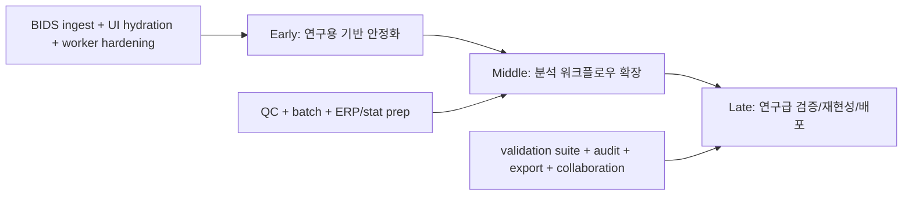

# NeuroWeave Research Tool Completion Roadmap

작성일: 2026-05-25

## 현재 판단

지금까지 만든 것은 "실제 데이터로 끝까지 도는 분석 MVP"이고, 이제부터는 연구용으로 신뢰할 수 있는 툴이 되기 위한 안정화, 재현성, 검증 단계가 필요하다. 기준은 BIDS EEG 구조와 MNE/MNE-BIDS 쪽 관례를 따라가는 것이 맞다.

현재 상태는 "실제 공개 EEG 데이터 2종에서 ingestion -> preprocessing -> epoch -> ERP -> comparison까지 끝까지 도는 검증 가능한 프로토타입"이다. 하지만 아직 실제 연구 결론을 내리는 데 바로 쓰기에는 부족하다.

## 현재 코드에서 바로 보이는 수정 필요점

- `apps/web/src/main.tsx`: event log가 mapping 직후에는 state에 들어가지만, 새로고침/재접속 시 `/datasets/{id}/events`를 다시 fetch하지 않아 UI가 `Unmapped`로 보인다.
- `apps/api/main.py`: CORS allowlist가 `5173/5174`에 고정되어 있어 임시 dev port에서 UI가 API unavailable로 보인다.
- `apps/api/main.py` worker subprocess: 실제 데이터 검증 때 Windows spawn/stdin 이슈 때문에 direct monkeypatch가 필요했다. 연구용이면 CLI entrypoint 기반 worker가 필요하다.
- `packages/eeg-io`: BIDS sidecar를 읽지 않아 OpenNeuro `.set`에서 channel type warning이 발생한다.
- `packages/eeg-io/src/eeg_io/event_logs.py`: BIDS `events.tsv`의 `n/a`, row filtering, condition source preset이 부족하다.
- warnings는 지금 string 중심이다. 연구용이면 severity/code/impact/action이 있는 structured warning이 필요하다.
- Phase 3 artifact naming/warning cleanup 변경은 아직 로컬 변경 상태다. 업로드 전이면 먼저 commit/push가 필요하다.

## 전체 파이프라인

## 초반: 구조 안정화 중심

목표: 지금 MVP를 "실제 공개 데이터 여러 개를 반복해서 안전하게 처리하는 기반"으로 바꾼다.

### 1. `ResearchDataset` 계층 추가

기존 `Dataset`, `Recording`, `EventLog`, `Run`은 유지하되, source/provenance 계층을 분리한다.

- `SourceDataset`: source name, URL, DOI, license, downloaded file manifest
- `BidsSidecarSet`: eeg_json, channels_tsv, electrodes_tsv, coordsystem_json, events_tsv
- `RecordingMetadata`: 기존 channel names 외에 channel types, bads, line frequency, reference, units 추가
- 기존 JSON registry는 깨지지 않게 optional field로 확장

### 2. BIDS sidecar ingest

새 모듈 권장:

- `packages/eeg-io/src/eeg_io/bids_sidecars.py`
- `read_bids_sidecars(base_path)`
- `apply_channel_sidecar(raw, channels_tsv)`
- `normalize_bids_events(events_tsv, preset)`

처리 목표:

- `_channels.tsv`의 `type`, `status`, `units` 반영
- `_eeg.json`의 `PowerLineFrequency`, `EEGReference`, sampling metadata 저장
- OpenNeuro `.set` warning을 "자동 보정됨/metadata 부족"으로 구조화

### 3. Event mapping v2

현재 mapping은 column 매핑만 있다. 연구용은 filtering과 condition derivation이 필요하다.

- `row_filter`: `trial_type == stimulus`
- `condition_column`: `value`, `trial_type`, `stim_file` 등
- `null_values`: `["n/a", "NA", ""]`
- preset: `psychopy`, `bids_events`, `eeglab_annotations`
- normalized event에는 `raw_row`, `source_file`, `source_columns` 일부 보존

### 4. UI hydration 수정

active dataset 변경 시 다음을 한 번에 로드하는 `loadDatasetContext(datasetId)`를 만든다.

- dataset detail
- `/events`
- `/validation`
- preprocessing runs
- epoch runs
- ERP runs
- latest completed run 자동 선택

이걸 먼저 고치면 OpenNeuro처럼 "backend는 mapped인데 UI는 unmapped"인 문제가 사라진다.

### 5. Worker 구조 교체

현재 multiprocessing spawn을 API 내부 함수로 직접 물고 있다. 연구용은 분리해야 한다.

- `python -m eeg_processing.worker_cli preprocessing --payload payload.json`
- `epoching`, `erp`도 같은 구조
- API는 payload JSON 작성 -> subprocess 실행 -> result JSON 읽기
- stdin/pickle 의존 제거
- cancellation은 process id + run status로 관리

### 6. Structured warning model

기존 `warnings: list[str]`는 유지하되, 새 `diagnostics.warnings[]`를 추가한다.

- `code`: `mne_unknown_channel_types`
- `severity`: `info | warning | risk | error`
- `source`: `mne | bids | validation | worker`
- `impact`
- `suggested_action`
- UI는 raw warning 대신 이 구조를 우선 표시

## 중반: 연구 워크플로우 확장

목표: 단일 파일 데모를 넘어서 "분석 검토가 가능한 워크벤치"로 만든다.

- QC dashboard
  - preprocessing: channel type, reference, filter, resampling, bad channels, annotations
  - epoch: condition counts, dropped epochs, out-of-bounds events, baseline summary
  - ERP: nave, GFP peak, selected channel peak, plot status
- Batch/multi-run support
  - subject/session/run grouping
  - 여러 preprocessing/epoch/ERP run을 batch로 생성
  - failed run만 retry
- Analysis config versioning
  - config hash
  - parent run id chain
  - artifact manifest schema version
- ERP comparison 확장
  - channel/ROI 선택
  - time window 저장
  - mean amplitude, peak amplitude, latency
  - 아직 통계 검정 전이라도 per-condition metric table 생성
- Export bundle
  - `analysis_report.json`
  - figures
  - artifact manifest
  - source/provenance
  - config snapshots

### 초반과의 호환성 유의점

- `output_metadata`는 compact summary만 유지하고, 큰 QC는 별도 JSON artifact로 저장
- legacy `raw_preprocessed.fif`, `epochs.fif`, `evoked_*.fif` fallback은 최소 한두 phase 유지
- API response shape는 optional field 추가 방식으로만 확장

## 후반: 연구급 완성

목표: "결과를 논문/프로젝트 분석에 쓸 수 있다"고 말할 수 있는 수준으로 올린다.

- 통계 Phase
  - subject-level table
  - paired/unpaired test
  - permutation test 옵션
  - multiple comparison correction
  - effect size, confidence interval
- Reproducibility
  - full run graph
  - source file checksum
  - package versions
  - OS/Python/MNE version
  - one-click rerun
- Validation suite
  - PhysioNet, OpenNeuro `.set`, EDF/BDF/BrainVision 샘플 고정 smoke
  - expected warning snapshot
  - visual regression for ERP preview
- Data governance
  - local-only mode
  - PHI/subject label warning
  - delete/export project
- Collaboration
  - project archive
  - shareable report
  - immutable completed analysis snapshot

## 추천 순서

1. 지금 로컬 A/B/C 안정화 변경 commit/push
2. UI hydration + CORS env화
3. worker CLI 분리
4. BIDS sidecar ingest
5. BIDS event mapping/filter preset
6. structured warning/diagnostics
7. QC dashboard
8. batch/multi-subject
9. statistics/export/reproducibility

## 결론

현실적으로, 초반 안정화까지 끝나면 "실제 연구 데이터 탐색용 툴", 중반까지 가면 "내부 분석 워크벤치", 후반까지 가야 "연구 결과 산출에 쓸 수 있는 툴"이라고 보는 것이 맞다.
